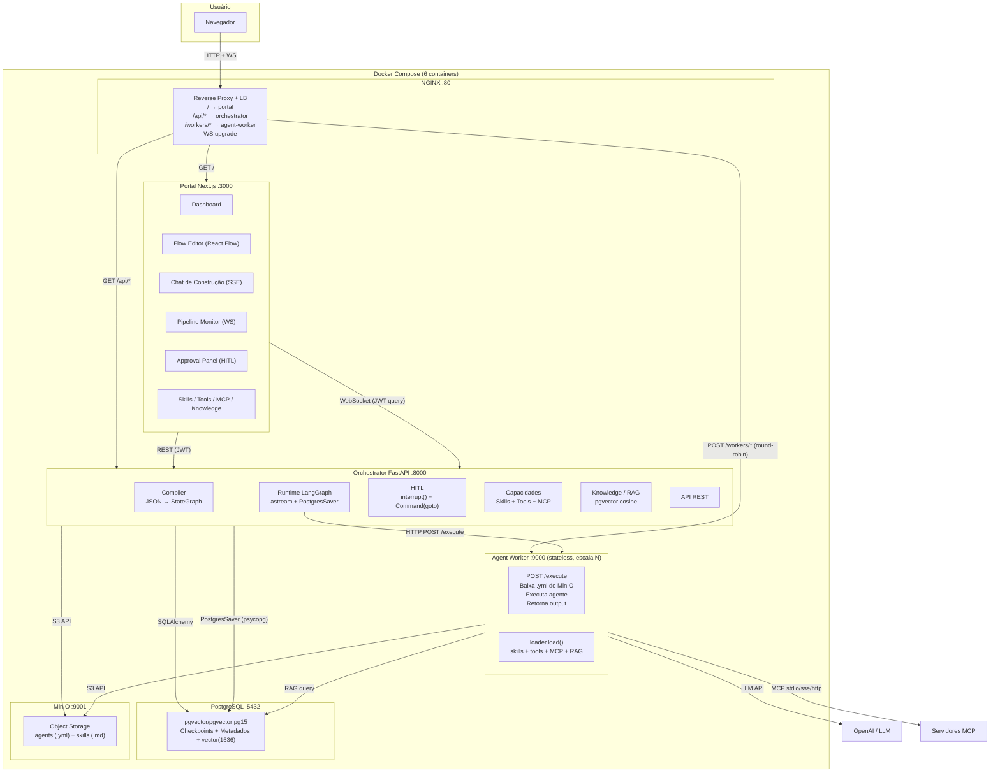
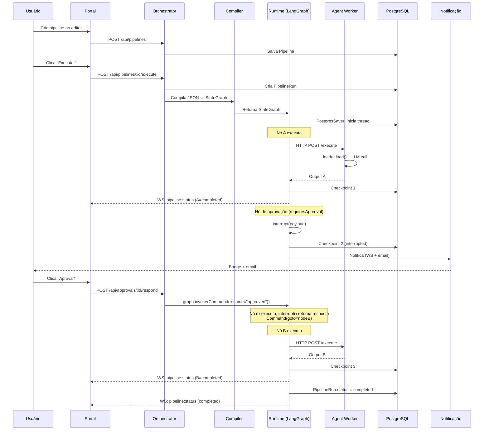

# Análise de Prontidão para Implementação — Agent Portal

> **Data:** 2026-09-22
> **Status:** Concluída
> **Método:** análise crítica de arquitetura, com foco em LangGraph, integração entre domínios e viabilidade de implementação com IA
> **Escopo:** spec atual (pós-aplicação dos 69 achados), plano de execução, domínios D5/D6/D7/D8
> **Contexto:** o usuário planeja apresentar o projeto à diretoria e implementar com auxílio de IA (LLM coding assistants)

---

## Confiança para Iniciar Implementação: 5.5/10

A spec está acima da média em detalhe e consistência interna. Os 8 achados críticos da análise anterior foram resolvidos (HITL redesenhado para `interrupt()` em nó, `PipelineRun` adicionado, `KnowledgeBase` formalizado, `nodeId` introduzido).

O problema restante **não está no texto da spec, está entre os domínios** — na superfície de integração entre D5 (compiler), D6 (runtime) e D7 (HITL). É aí que a IA vai errar consistentemente, porque a spec descreve **o que** cada domínio faz, mas não **como eles interoparam no nível de processo/thread**.

O projeto pede à IA que implemente um sistema onde o compiler gera código Python em runtime (node functions como closures), que deve interoperar com um worker pool em processos separados, mantendo integridade de checkpoint do LangGraph através de fronteiras de processo. Não é um projeto "CRUD + chamar API". É um problema de sistemas distribuídos vestindo roupa de CRUD.

---

## Top 5 Riscos (ordenados por impacto)

### 1. A arquitetura de worker quebra o modelo de execução do LangGraph (CRÍTICO)

**Onde:** D6 §6.1, D6 §6.11, D5 "Node Function Contract"

A spec diz que a node function chama `worker_client.execute()` via HTTP. Mas a node function roda **dentro** do event loop do grafo. Consequências:

- O `astream`/`stream_events` fica **bloqueado** durante a chamada HTTP (LLM call de 30s = 30s de stream parado).
- Se o worker cai, a exceção **aborta o `astream` inteiro**. Não existe "marcar o nó como failed e continuar" sem try/except que retorne um state update com `status: "failed"`.
- O retry (3 tentativas, backoff 2s/4s/8s) bloqueia o thread do LangGraph por até 14s sem progresso. O timeout precisaria disparar **concorrentemente** com o retry, o que exige a node function ser async com timeout como task separada. Não está descrito.

**O que a IA vai errar:** vai escrever `await worker_client.execute(...)` sem try/except e assumir que pode "marcar o nó como failed". Na realidade, exceção não tratada em node function **aborta a execução do grafo inteiro**.

**Resolução:** definir o contrato de erro da node function: **nunca raise, sempre retorna** `{"status": "failed", "error": "..."}` como state update. O executor detecta a falha lendo o state final, não capturando exceção.

---

### 2. "Gerar TypedDict dinamicamente" não é como o LangGraph funciona (ALTO)

**Onde:** D5 §5.4

O `StateGraph` espera um schema estático. Criar um `TypedDict` novo por pipeline via `types.new_class()` vai "funcionar" em teste simples mas quebra no checkpoint round-trip (o PostgresSaver armazena metadados de schema). Se o schema muda entre compile e resume (ex: novo port adicionado), o checkpoint fica incompatível.

**O que a IA vai errar:** vai usar `types.new_class()` ou `typing.TypedDict` dinamicamente, passar para `StateGraph()`, e vai quebrar no:
- Checkpoint load com schema diferente
- Validação interna do LangGraph rejeitando o tipo dinâmico
- `Annotated` reducers não resolvendo em classes criadas dinamicamente

**Resolução:** State schema **fixo**: um `TypedDict` com estrutura genérica (`data: dict`, `iterations: dict`, `status: str`, `actions: dict`). O namespacing por nodeId é convenção dentro dos valores do dict, não feature de schema.

---

### 3. O grafo compilado não é persistível. Resume exige recompilar (ALTO)

**Onde:** D5 §5.3, D6 §6.1, D7 §7.4

O `StateGraph` com node functions como closures **não é serializável**. Não pode ser salvo, enviado por rede, ou reconstruído de checkpoint. A cada resume, o grafo precisa ser **recompilado** do JSON da pipeline.

A spec diz "chamar `graph.invoke(Command(resume=...), config)`" mas nunca diz que o `graph` precisa ser **reconstruído** antes.

**O que a IA vai errar:** vai tentar:
- Pickle o StateGraph (falha)
- Guardar referência em dict global (quebra no restart)
- Não perceber que precisa recompilar (erro "graph not found" no resume)

**Resolução:** adicionar `compile_and_resume(pipeline, thread_id, resume_value)` no D6: (1) carrega pipeline do DB, (2) compila para StateGraph, (3) chama `graph.invoke(Command(resume=...), config)`.

---

### 4. `Command(goto=...)` exige nomes reais de nós, não labels conceituais (MÉDIO-ALTO)

**Onde:** D5 "requiresApproval no compiler", D7 §7.1

A spec usa `Command(goto="proceed")` e `Command(goto="reject_handler")` como se fossem nomes de nós. No LangGraph, o string em `Command(goto=...)` **deve ser o nome real do nó** registrado no StateGraph.

**O que a IA vai errar:** vai usar "proceed" e "reject_handler" como strings literais, e o LangGraph vai falhar porque esses nós não existem no grafo.

**Resolução:** o nó de aprovação deve retornar `Command(goto=target_node_id)` onde `target_node_id` é o `PipelineNode.id` real do target. Para reject: `Command(goto=source_node_id)` (loop back) ou `Command(goto=END)` (encerrar). Isso deve ser configuração na edge, não string hardcoded.

---

### 5. `maxIterations`: mecanismo de enforcement ainda ambíguo (MÉDIO)

**Onde:** D5 "maxIterations no State", D6 §6.4, Spec §5.2

A spec diz "a enforcement é feita pelo runtime (D6), não pelo compiler". Mas **como** o runtime enforce? LangGraph não tem mecanismo de "abort". As opções são:
- (a) Node function checa e retorna state que roteia para `END`
- (b) Route_fn checa e roteia para `END`
- (c) Executor monitora o state após cada step

**O que a IA vai errar:** vai implementar como check na node function que **raise exception**, o que aborta o `astream` e deixa o checkpoint inconsistente. Ou vai implementar na route_fn (contrariando a spec) e criar dual-enforcement.

**Resolução:** a **node function** checa `state["iterations"][nodeId] >= maxIterations` no início. Se excedido, retorna `{"status": "failed"}` e a route_fn roteia para `END`. O executor detecta a falha lendo o state final.

---

## Lacunas que a IA vai encontrar e errar

| # | Seção | Ambiguidade | Assumção errada que a IA vai fazer |
|---|-------|-------------|-------------------------------------|
| 1 | D5 §5.4 | "Gerar o TypedDict dinamicamente" | Vai usar `types.new_class()`. Deveria ser schema fixo com `dict` values. |
| 2 | D6 §6.1 | "A função do nó chama `worker_client.execute()`" | Vai assumir que pode raise. Na realidade, deve **catch** e retornar state update com `status: "failed"`. |
| 3 | D7 §7.4 | "Chamar `graph.invoke(Command(resume=response), config)`" | Vai assumir que o `graph` está disponível. Na realidade, precisa **recompilar** do JSON. |
| 4 | D5 "requiresApproval" | `Command(goto="proceed")` / `Command(goto="reject_handler")` | Vai usar como strings literais. Devem ser **node IDs reais**. |
| 5 | D6 §6.2 | "PostgresSaver configurado com DATABASE_URL" | Vai assumir `PostgresSaver(DATABASE_URL)`. Na realidade é `PostgresSaver(Connection)` com psycopg. |
| 6 | D5 §5.5 | "route_fn principal combina conditions + fallback" | Vai assumir que uma route_fn por nó resolve tudo. Mas a **ordem de precedência** entre conditions não está definida. |
| 7 | D6 §6.1 | "O executor detecta a pausa (stream termina sem END)" | Vai assumir que o stream "termina". Na realidade, `stream_events` tem `stream.interrupted = True` e `stream.interrupts` com payloads. |
| 8 | D5 §5.3 | "Fan-out: `add_conditional_edges(source, route_fn, {"follow": [nodeA, nodeB]})`" | A IA confunde se a função retorna a **chave** ("follow") ou a **lista** de targets. Retorna a chave. |
| 9 | D6 §6.4 | "contador por agente por execução" | Vai assumir que o contador é em estrutura separada. Na realidade, precisa estar no **State** (para sobreviver a checkpoints). |
| 10 | D8 §8.2 | "loader.load(agent_snapshot) -> AgentCapabilities" | Vai assumir que é uma chamada simples. Na realidade envolve: download de skills do MinIO, descoberta de MCP tools (spawn de processos), query RAG (embedding + vector search). Operação **pesada** (segundos). O spec não define onde roda (orchestrator ou worker). |

---

## Verificação de Precisão LangGraph

| Claim na Spec | Veredito | Explicação |
|---------------|----------|------------|
| "O `interrupt()` é primitivo de **nó**: só pode ser chamado dentro de uma função de nó" | **CORRETO** | Docs oficiais: "Interrupts work by calling the `interrupt()` function at any point in your graph nodes." |
| "O nó de aprovação re-executa do início" | **CORRETO** | Docs: "the runtime restarts the entire node from the beginning—it does not resume from the exact line where interrupt was called." |
| "Ao chegar no `interrupt()`, ele recebe a resposta armazenada em vez de pausar" | **CORRETO** | Docs: "The value passed to Command(resume=...) becomes the return value of the interrupt call." |
| "O nó retorna `Command(goto="proceed")`" | **PARCIALMENTE CORRETO** | O padrão está certo, mas o string deve ser o **nome real do nó** no grafo, não um label conceitual. |
| "`Command(resume=response)` para retomar" | **CORRETO** | Docs mostram exatamente esse padrão. |
| "Fan-out: múltiplos targets para 'follow' → lista no mapping" | **CORRETO** | LangGraph suporta execução paralela via lista no mapping de conditional edges. |
| "PostgresSaver do LangGraph" | **PARCIALMENTE CORRETO** | Pacote separado: `langgraph-checkpoint-postgres`. Constructor toma `psycopg` connection, não `DATABASE_URL` string. |
| "O LangGraph salva o checkpoint automaticamente via PostgresSaver (on interrupt)" | **CORRETO** | Docs: "When an interrupt is triggered, LangGraph saves the graph state using its persistence layer." |
| "Reducer: `last` (padrão LangGraph) para todas as keys" | **PARCIALMENTE CORRETO** | O default é **overwrite** (last write wins), não um reducer chamado "last". Para `iterations`, usar `Annotated[int, operator.add]` é mais robusto. |
| "Múltiplos interrupts em paralelo: `Command(resume={"id1": r1, "id2": r2})`" | **CORRETO** | Docs mostram exatamente esse padrão. |
| "Side effects before interrupt must be idempotent" | **CORRETO** | Docs: "Side effects called before interrupt must be idempotent." A spec/D7 coloca persistência e notificação **após** o interrupt. |
| "thread_id isola checkpoints de execuções diferentes" | **CORRETO** | Docs: "thread_id is your pointer: set config={'configurable': {'thread_id': ...}} to tell the checkpointer which state to load." |
| "O State precisa serializar/deserializar no PostgresSaver sem perda" | **PARCIALMENTE CORRETO** | Todos os valores no State devem ser **JSON-serializáveis**. Se um port carrega objeto Python (ex: instância de classe), o checkpoint falha. A spec não enforce isso. |

---

## Amizade com Implementação por IA

### AI-Friendly (contratos claros, interfaces bem definidas, unidades testáveis)

| Domínio | Por quê |
|---------|---------|
| **D1 (Infra)** | Docker Compose, Dockerfiles, nginx.conf. Mecânico, sem ambiguidade. |
| **D2 (Auth)** | NextAuth + JWT middleware. Padrão conhecido, bem documentado. |
| **D3 (Models + API stubs)** | Tradução TypeScript → SQLAlchemy. Mecânico. |
| **D4 (Agent CRUD)** | CRUD + validação. Chat SSE é o único ponto complexo, mas o contrato é claro. |
| **D9 (RAG)** | Chunking, embedding, vector search. Caminho trilhado. Rivvn é o risco (SDK externo). |
| **D8 (Skills/Tools/MCP)** | CRUD + sandbox. MCP client (process management) é o ponto complexo. |

### AI-Hostile (comportamento ambíguo, assunções implícitas, cross-cutting concerns)

| Domínio | Por quê |
|---------|---------|
| **D5 (Compiler)** | **O mais AI-hostile.** Exige: (1) entendimento profundo da API StateGraph, (2) geração de código dinâmico (closures), (3) 11 regras de validação com interações sutis, (4) topologia correta para approval nodes. A IA acerta A→B→C e falha em fan-out com conditions, loops com maxIterations, approval nodes com `Command(goto=...)` correto. |
| **D6 (Runtime)** | **Segundo mais AI-hostile.** Exige: (1) `astream`/`stream_events` com interrupts, (2) worker pool com retry/timeout **dentro** do contexto de execução do grafo, (3) detecção de interrupts do stream, (4) recompilar grafo no resume, (5) WebSocket broadcast com lifecycle. |
| **D7 (HITL)** | **Terceiro mais AI-hostile.** Exige: (1) approval node com `interrupt()` + `Command(goto=...)` correto, (2) idempotência na re-execução, (3) multi-interrupt resume, (4) recompilar antes de resume (não mencionado na spec), (5) coordenação com executor (D6). |
| **D10 (Frontend)** | Grande superfície (10+ views), WebSocket, React Flow com edge panels. A IA gera componentes individuais mas trava em: reconnection logic, edge configuration panel (state complexo), real-time monitor (re-render storms). |

---

## Riscos para Apresentação à Diretoria

### Claims de Overpromising

| Claim | Risco | O que dizer em vez |
|-------|-------|-------------------|
| "Checkpoints no PostgreSQL permitem retomar de onde parou" | **ALTO.** O checkpoint/resume é a parte mais complexa e é onde mais bugs vão viver. A arquitetura de worker (HTTP calls dentro de node functions) torna a integridade de checkpoint não-trivial. | "O sistema salva o estado a cada passo, permitindo retomada em caso de falha. A retomada após falha de um agente individual está em desenvolvimento." |
| "Humano é parte do grafo. Não é exceção, é um nó" | **MÉDIO.** O modelo HITL está corretamente desenhado para LangGraph, mas o caso de **multi-interrupt** (fan-out com múltiplas aprovações) é complexo e não testado. O fluxo "argumentar/revisar" (injetar feedback no state) não está bem especificado em termos de **onde** no state o feedback vai e **como** o próximo agente lê. | "Aprovações humanas são nativas no fluxo. O caso de múltiplas aprovações em paralelo está em desenvolvimento." |
| "Falha não é perda" | **ALTO.** O mais perigoso para a diretoria. A fault tolerance da spec é: (1) checkpoint por nó, (2) retry em falha de worker, (3) maxIterations como anti-loop. Mas **não** existe: partial node failure (agente executou mas output é inválido), detecção de alucinação de LLM, ou rollback automático. | "O sistema salva checkpoints a cada passo, minimizando o trabalho perdido em caso de falha." |
| "Agentes têm contrato. Entrada, saída e ações são declarados, validados no wiring" | **MÉDIO.** A validação de contrato é no nível do **grafo** (ports batem, tipos compatíveis). Mas **não** existe validação em runtime de que o output real do agente bate com os `outputs` declarados. O LLM pode retornar qualquer coisa. | "O contrato de entrada/saída é validado no design da pipeline, garantindo que o wiring seja coerente." |
| "Docker Compose local" (implícita simplicidade) | **BAIXO.** 6 serviços (nginx, portal, orchestrator, worker, postgres, minio) não é trivial de debugar. | "Ambiente local completo com um comando, incluindo orquestrador, workers e banco de dados." |

### O que Demostrar vs. Descrever

| Demostrar (seguro, vai funcionar) | Descrever (arriscado, pode não funcionar na demo) |
|----------------------------------|---------------------------------------------------|
| CRUD de agentes (cards, chat de construção) | Execução de pipeline com loop (A→B→A) |
| Editor de fluxo (drag-and-drop, validation) | Human-in-the-loop com aprovação/rejeição |
| Biblioteca de skills/tools | Fan-out com múltiplos agentes em paralelo |
| Knowledge Base upload + query | Retomada de checkpoint após falha |
| Monitor de execução (status de nós) | Multi-interrupt (fan-out + aprovação) |
| | Tools custom em sandbox |
| | MCP server connection + tool discovery |

**Recomendação:** para a demo à diretoria, mostrar o lado de **design** (criação de agentes, editor de fluxo, knowledge base) e uma **execução linear simples** (A→B→C, sem loops, sem aprovações). Descrever HITL, loops e fault tolerance como "próxima fase" ou "em desenvolvimento". **Não** tentar demo de loop com aprovação em frente à diretoria.

---

## Ações Recomendadas Pré-Implementação

### Obrigatórias (antes de escrever qualquer código)

1. **Resolver a questão da arquitetura de worker (Risco #1)**
   - Decidir: a node function chama o worker (bloqueando o thread do grafo) ou o executor orquestra fora do grafo?
   - Se a primeira: definir o contrato de erro (node function catcha erros do worker, retorna `{"status": "failed"}`, nunca raises).
   - Se a segunda: o "StateGraph" não está realmente executando agentes, é só um engine de roteamento. A spec precisa ser reescrita para refletir isso.
   - **Ação:** escrever 1 página ADR documentando a decisão. Atualizar contratos D5, D6, D7.

2. **Corrigir o design do State Schema (Risco #2)**
   - Substituir "gerar TypedDict dinamicamente" por **schema fixo**: um `TypedDict` com estrutura genérica (ex: `{"data": dict, "actions": dict, "iterations": dict, "status": str}`).
   - O "namespaced by nodeId" vira **convenção dentro dos valores do dict**, não feature de schema.
   - **Ação:** reescrever D5 §5.4 com o schema fixo. Atualizar o Node Function Contract para ler/escrever do dict aninhado.

3. **Definir o fluxo de Resume explicitamente (Risco #3)**
   - Adicionar ao D6: "Antes de resumir, o executor deve recompilar o StateGraph do JSON da pipeline (porque o objeto grafo não é persistido). A função `compile_and_resume()`: (1) carrega pipeline do DB, (2) compila para StateGraph, (3) chama `graph.invoke(Command(resume=...), config)`."
   - **Ação:** adicionar ao D6 §6.1 e D7 §7.4.

4. **Corrigir os nomes de target do `Command(goto=...)` (Risco #4)**
   - No D5 "requiresApproval no compiler": mudar `Command(goto="proceed")` para `Command(goto=target_node_id)` e `Command(goto="reject_handler")` para `Command(goto=reject_target_id)`.
   - Definir o que é `reject_target_id`: o source node (loop back) ou `END` (encerrar). Deve ser **configuração** na edge, não string hardcoded.
   - **Ação:** adicionar campo `rejectTarget: string` ao `PipelineEdge` (ou derivar: se a edge tem `condition` com `value: "return"`, o reject target é o source; senão, é `END`).

5. **Definir o mecanismo de enforcement de `maxIterations` (Risco #5)**
   - Especificar: a **node function** checa `state["iterations"][nodeId] >= maxIterations` no início. Se excedido, retorna `{"status": "failed", "pipeline.status": "failed"}` e a route_fn roteia para `END`.
   - O executor detecta a falha lendo o state final após o stream terminar.
   - **Ação:** atualizar D5 Node Function Contract (adicionar step 0: check iterations) e D6 §6.4 (remover `iter_counter.py` separado, está na node function).

### Recomendadas (reduzem rework)

6. **Adicionar uma fase de "Spike" antes de D5/D6/D7**
   - Antes de implementar o compiler/runtime/HITL completos, construir um **spike**: uma pipeline A→[approval]→B com:
     - `StateGraph` real com 3 nós
     - `PostgresSaver` real
     - `interrupt()` + `Command(resume=...)` real
     - Chamada HTTP a um worker dentro da node function
   - Esse spike revela 80% dos problemas de integração em 2-3 dias de trabalho.
   - **Ação:** adicionar "FASE 0: Spike" ao plano de execução.

7. **Clarificar onde `loader.load()` roda**
   - D6 diz que o orchestrator chama `loader.load()` antes de delegar ao worker. Mas `loader.load()` envolve RAG queries e MCP discovery (operações pesadas). Deveria rodar **no worker**, não no orchestrator.
   - **Ação:** mover `loader.load()` para o worker. O orchestrator envia o `agentSnapshot` para o worker; o worker carrega capacidades e executa.

8. **Definir o envelope de erro para todas as APIs**
   - A spec só define o formato de erro para validação de grafo (`{"errors": [...]}`). Todos os outros endpoints (401, 404, 409, 422, 500) não têm formato definido.
   - **Ação:** adicionar seção na spec: "Error Format: `{"error": string, "code": string, "details"?: object}`" com exemplos para cada HTTP status.

9. **Pinar versão do LangGraph e documentar diferenças de API**
   - A API do LangGraph mudou significativamente entre versões (o `stream_events(version="v3")` é relativamente novo). A spec deve pinar a versão exata e documentar qual superfície de API usa.
   - **Ação:** adicionar ao D1: `langgraph==0.2.x` (ou a stable atual) e `langgraph-checkpoint-postgres==0.1.x`. Nota: "Esta spec assume a API `stream_events(version='v3')`. Não usar a API legacy `stream()`."

10. **Remover ou adiar a integração Rivvn da V1**
    - A integração Rivvn depende de um SDK externo não especificado (nome do pacote, versão, API). Tem um gate comercial (`contractStatus`) que adiciona complexidade. **Não** é necessária para a proposta de valor central.
    - **Ação:** mover Rivvn para V2. Manter `source: "rivvn"` na definição de tipo mas marcar como "não implementado na V1". Remove um sub-domínio inteiro (D9 §9.7-9.11) do caminho crítico.

---

## Estratégia de Implementação com IA

### Ordem recomendada (diferente do plano original)

```
FASE 0 (Spike) — 2-3 dias
└── Pipeline A→[approval]→B com LangGraph real + PostgresSaver + worker HTTP
    Objetivo: validar a arquitetura antes de investir 6 semanas

FASE 1 (Fundação) — AI-friendly
├── D1: Infraestrutura & Setup
└── D2: Autenticação & Segurança

FASE 2 (Base) — AI-friendly
└── D3: Modelo de Dados & API Base

FASE 3 (Núcleo) — AI-friendly
├── D4: Agentes (CRUD + Contrato)
└── D9: Knowledge & RAG (sem Rivvn)

FASE 4 (Capacidades) — Parcialmente AI-friendly
└── D8: Skills + Tools + MCP

FASE 5 (Orquestração) — AI-hostile (usar spike como referência)
└── D5: Pipeline (Grafo + Compiler)

FASE 6 (Execução) — AI-hostile (usar spike como referência)
└── D6: Runtime & Orquestração

FASE 7 (Humano no Loop) — AI-hostile (usar spike como referência)
└── D7: Human-in-the-Loop & Notificações

FASE 8 (Portal) — Parcialmente AI-friendly
└── D10: Portal Frontend (Next.js)
```

### Regra de ouro para implementação com IA

**Nunca deixar a IA implementar D5/D6/D7 sem um exemplo funcional do padrão.** O spike da FASE 0 é esse exemplo. Com ele, a IA tem um código de referência concreto para seguir, em vez de só a spec. Sem o spike, a IA vai inventar padrões que não funcionam com LangGraph.

---

## Diagramas de Arquitetura

### Arquitetura de Sistemas



### Fluxo de Execução (com HITL)



---

## Log de Análise

| Data | Dimensão | Status |
|------|----------|--------|
| 2026-09-22 | Prontidão para implementação | Concluída |
| 2026-09-22 | Precisão LangGraph | Concluída |
| 2026-09-22 | Amizade com IA | Concluída |
| 2026-09-22 | Riscos para diretoria | Concluída |
